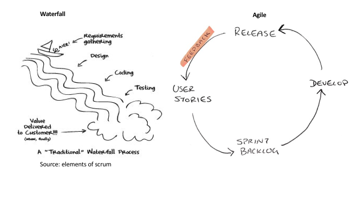

# Agile and Scrum

## Morning Scrum

- Review Scrum Roles & Assign
	- Product Owner
	- Scrum Master
	- Team Member

- Have meeting
	- What have you been working on since the last meeting?
	- What are you working on between now and the next meeting?
	- What are your blockers?

## Waterfall vs Iterative Development

## A Scrum-ified (Scrum-ish?) J-term

Aggregate responses:
[https://docs.google.com/forms/d/1cVr0Qbd28kzV5ZAj7yAoKd0sSOvXVHJq2jBJxRbhccY/edit#responses](https://docs.google.com/forms/d/1cVr0Qbd28kzV5ZAj7yAoKd0sSOvXVHJq2jBJxRbhccY/edit#responses)

* Do you think that you will use code or data analysis in your future work?
* Also see Google Keep note for summary of responses

## Writing Good User Stories

**As a _____**\<role\>**_____________**

**I want _____**\<feature\>**_________**

**So that _____**\<value\>**__________**

### User Stories ought to be

* **I**ndependant - stories can be worked on in any order
* **N**egotiable - A story is not a contract.  A story IS an invitation to a conversation.
* **V**aluable - If a story does not have discernable value it should not be done.
* **E**stimable - What happens if a story can’t be estimated?  You can split the story and perhaps gain more clarity. Or do more research to estimate it.
* **S**mall - Suggested 3-4 days of work max. For our class lets say 1 day of work MAX.
* **T**estable - How do you know when you're done?

#### Definition of Done

User stories ought to have a definition of done. Generally there is one generic definition of done that applies to every story in the project, but aslo specific **acceptance critera** for each story.

Source:
[http://agileforall.com/new-to-agile-invest-in-good-user-stories/](http://agileforall.com/new-to-agile-invest-in-good-user-stories/)

###  Try It

Since we're running a scrummy class, and this class is our product. Lets write good user stories for the class! Lets do this one in pairs.

1. Brainstorm stakeholders
2. Write user stories
	* 2 as yourselves
	* 1 as other "users" (in our case stakeholders)
3. For each story, make sure you have a definiton of "done" as well as a checkbox for I-N-V-E-S-T. Be honest about which part of I-N-V-E-S-T it meeets and which part it does not meet.

Lets share and workshop them together. Present one and put the rest up on the board. I will look through them after class and see how they can inform the development of the course.

## Agile

### Agile is Cyclical

Parallels to [Design Thinking](https://dschool.stanford.edu/groups/k12/wiki/17cff/Steps_in_a_Design_Thinking_Process.html)

### Agile Manifesto

> **Individuals and interactions** over processes and tools
>
>**Working software** over comprehensive documentation
>
>**Customer collaboration** over contract negotiation
>
>**Responding to change** over following a plan

Source: [http://agilemanifesto.org/](http://agilemanifesto.org/)

### Agile Principles

* Lets review the 12 agile principles from the "Elements of Scrum" recommended reading on https://read.amazon.com/
* Also found here: [https://www.agilealliance.org/agile101/12-principles-behind-the-agile-manifesto/]( https://www.agilealliance.org/agile101/12-principles-behind-the-agile-manifesto/)

### Few additional resources
* [The cartoon](https://www.tamingdata.com/wp-content/uploads/2010/07/tree-swing-project-management-large.png): Agile helps to prevent this. Continuous delivery and feedback.
* Agile vs Waterfall: http://www.agilenutshell.com/agile_vs_waterfall

### An Agile J-Term
Split up into 4 teams:

- 5 minutes of research on your topic
- 10 minutes of discussion about how that might apply to the course
- share that with the rest of the class

### Agile in Government
(Well, specifically the US Government)

Much of government traditionally operates in the waterfall style.

> Policy -->
> 
> Requirements Gathering/Design -->
> 
> Procurement/Contracts/etc -->
> 
> Development -->
> 
> Press release -->
> 
> Implementation

Some agencies are pushing for more agile development.

Its still nacent, but gaining momemtum. Like a baby holding onto the railing and learning to walk. -
[David Zvenyach](https://www.linkedin.com/in/vdavez) (Executive
Director of 18F)

## Scrum Overview

A toolset for Agile Software Development

### Roles

- Product Owner
- Scrum Master
- Team Member

### Meetings / Ceremonies

- Sprint Planning
	- What will we do?
		- Product owner proposes user stories to tackle
		- Team decides on which stories they'll commit to in this sprint
	- How will we do it?
		- User stories split up into tasks
		- Tasks are placed in sprint backlog
- Daily Scrum
	- Daily, max 15 mins
	- 3 simple questions
		- What have you been working on since the last meeting?
		- What are you working on between now and the next meeting?
		- What are your blockers?
- Story Time
	- "Grooming" your backlog
	- Stories "values" for burndown decided upon (planning poker)
	- Larger, abstract, further away stories are split and hashed out
	- Acceptance criteria are defined and refined
- Sprint Review
	- Demonstrate the stories that got done during the sprint to all stakeholders
- Retrospective
	- Identify 1 or 2 strategic changes for the next sprint, quick + and Δ

### Artifacts

- Product Backlog (List of User Stories)
- Sprint Backlog
- Task Board (trello)
	- ICEBOX, TODO, DOING, BLOCKED, DONE
	- can customize based on your definition of done (multiple stages of done?)
- Burn Chart
- Definition of Done

### Scrum Teams

* Small (7 +/- 2)
* Cross Functional
* Self Organizing

## While you wait

Check out [http://data.gov](http://data.gov) or [https://datausa.io/](https://datausa.io/). Poke around to find datsets that may be of interset to you. Find one that you find of particular interst and think of the kinds of questions you'd like to answer with it.

